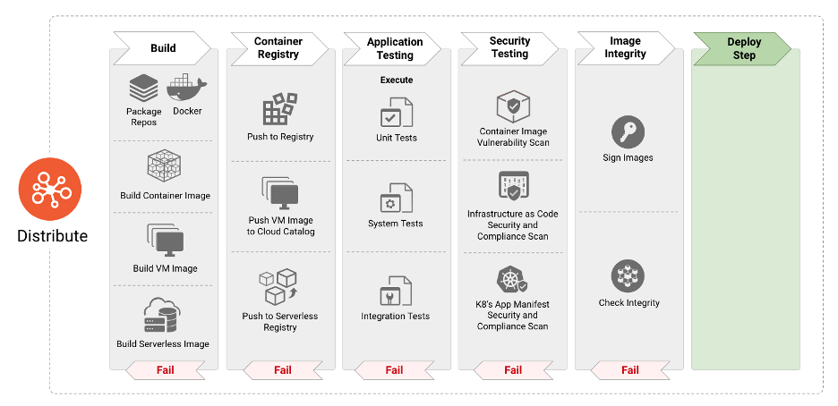
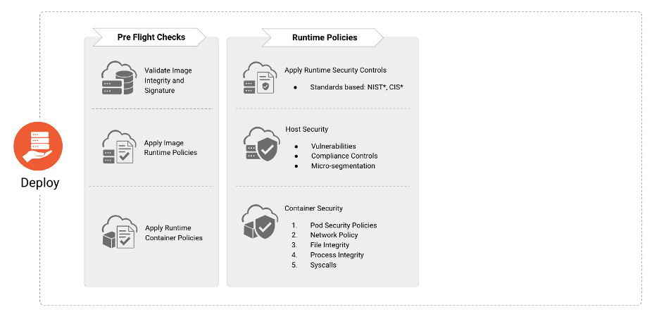

# System Architecture

## System Strategy

### Word of wisdom

- The golden rule which must be followed is as follows. Everything must be managed as code.
- Mesure, mesure and mesure everything. Use "Observability" pattern solution. It is all about control.
- Use MOB as development process. This will bring knowledge and quality into the teams.

### Asynchronous release
In continuous delivery CD any infra/app could be released at any time. Asynchronous from each other. The deploy will happen by Spinnaker/Jenkins automatically once the code is pushed to git. This means that uncontrolled breaking changes are strongly forbidden.

### Contracts
To comply to the agreed contract is the soul of building software landscapes between producer and consumers.

All integrations points should have a contract. The contracts should be managed in an API managment system e.g. API gateway, APIGEE, Mulesoft.

This will enable a governance layer over all integrations.

Examples of integrations:

- Application Services (REST, SOAP,...)
- Database integrations such as STORE PROCEDURES
- Batches
- Data flows
- File transfers

#### Traditional deployment approch

The matrix below describes what a Environment strategy normally looks like. Copy-paste the goodies like the Quality Gates into the BLUE/GREEN deployment pipeline. 

Environment | Purpose | Quality Gates | Comment
------------ | ------------- | ------------- | -------------
DEV | Sandbox for development, component tests (UT) | Code Review from MR, static code analysis ok | Only a subset environment, likely to be a local dev pc
QA | UIT | SmokeTests, Run automated tests, regression test, monitoring test|  functional tests
ACC/PT | Complete flows| performance test, security tests, look-and-feel, Release Note approval |  Downscaled (X) prod environment
PROD | Environment for customers | | 

### System Architecture Diagram

The HLD (High Level Design) below describes one solution for the problem statement. Something like ~10+ nodes for RabbitMQ is required for "caters for millions of users". RabbitMQ is an awesome component for building distributed system. However it is also a large complex component, see detailed info at [RabbitMQ](https://www.rabbitmq.com/admin-guide.html).

The HLD is on a really high level and assumes that something like ["AWS Well-Architected Framework"](https://aws.amazon.com/architecture/well-architected/?ref=wellarchitected-wp) is used as the foundation in the implementation. 

Based on five pillars
* Operational excellence (automating changes, responding to events, and defining standards to manage daily operations)
* Security (confidentiality and integrity of data, identifying and managing who can do what with privilege management, protecting systems, and establishing controls to detect security events)
* Reliability (distributed system design, recovery planning, and how to handle change)
* Performance efficiency (selecting the right resource types and sizes based on workload requirements, monitoring performance)
* Cost optimization (focuses on avoiding unnecessary costs)

# Deployment (Infrastructure & Application) methodology

Component | Infrastructure | Application | Comment
------------ | ------------- | ------------- | -------------
Terraform | X | |  Terraform scripts in GIT
CI (GIT, Jenkins) |  | X | Artifact saved as VM image or Docker image
CD (Spinnaker, k8s) | X| X |  Spinnaker pipeline for Application: DEV->TEST->PROD. CD for Infrastructure needs runner executor node (DEV cli or VM).

Code changes always starts from DEV->TEST->PROD. Each (environment) has Quality Gates making the change more safe to deploy into PROD.

Always force and fix issues and incidents to PROD. Rollback should not be performed.

### Highlevel CI

Developer push code to git from MR. This triggers (Webhook) a build. Compile->Test->Build (artifact/docker image)->Push Artifact.

Infrastructure components should be coded in Terraform or other IaC (cloud agnostic) language. MR into master triggers a terraform execution with the delta.

### Highlevel CD

Spinnaker observes new artifacts from container registry.

When a new artifact version occurs the Spinnaker triggers a new deployment to TEST stage. The Spinnaker pipelines then uses the BLUE/GREEN deployment.

# Deployment automation tools (Infrastructure & Application)

[Spinnaker](https://spinnaker.io/concepts/) takes care of the two key areas

### Spinnaker Application Management
Features to view and manage your cloud resources.

Applications, clusters, and server groups are the key concepts Spinnaker uses to describe your services.

### Spinnaker Application Deployment (pipelines)
Manage the CD [pipeline](https://spinnaker.io/concepts/pipelines/).

### BLUE/GREEN deployment approach

One environment running the "PROD" version. The other is a release candidate with the delta for the new release. When promoting the new release candidate, switch DNS (loadbalancer). After some time when everything runs smooth update the previous prod environment. Spinnaker takes care of this.

NOTE: Caution when the release involves database layer!

# Backups policy

* All application and infrastructure code is in GIT and container registry.
* Database tiers needs to have a backup policy determine various points
    * Validity TTL
    * Sensitive data
    * Runtime/Persistence data
    * Size of data
    
At least schedule daily Backup (recovery peroid of 30 days) when the system has the lowest latency.

## Backup policy for RabbitMQ
A data directory contains two types of data: definitions (metadata, schema/topology) and message store data.

Minimum is to schedule daily Backup of datatype definitions.

# Security policy and implementation

The strategy is to give as little authority as possible to consumers.

Pre-defined policies should be used and if not existing one should be created and used. For further detail see Pillar: Security.

# Security Runtime Environment

# Alerts and Monitoring
Use the Elasticsearch (ELK) stack which fulfill the Observability pattern.

This includes:

- Store, search and aggregate data.
- metrics (ITIL, application metrics)
- logs
- APM (Application Performance Monitoring - detect and manage flows, transactions, bottlenecks, root cause investigations in the system)
- Alerts (alarms)
- Visualize (dashboards, reports, cool apps)
- Security (OWASP)
- Anormaly detection (Machine learning)

NOTE: **proactive** detections such as alerts and dashboards visualization is a key for success. Huge flexability for diffrent users in the system e.g developers and ITIL operations.

The Kubernetes clusters needs a monitoring tool such as Grafana or Prometheus.

# ~~Logging/Metrics~~
See chapter Monitoring solution.

# HA/Scaling

## Spinnaker HA/Scaling

Spinnaker takes fixes alot of the HA and scaling implementation using scale sets and server groups.

This is defined in the configuration of the deployment cluster. Strategy: BLUE/GREEN. Scale down replace server groups.

However, there is no one-size-fits-all approach for configuring [Spinnaker](https://spinnaker.io/setup/productionize/).

* Spinnaker - Externalize Redis for Caching
* Horizontally Scale Spinnaker Services
  * Scaling Clouddriver
  * Scaling Orca (execution engine)

Stuff Spinnaker should take care of if managed by Spinnaker.

### k8s HA/Scaling

One of the most power features of orchestration tools such as Kubernetes is the ability to automcatically scale resource allocation in response to real-time changes in resource usage.

However, when the Spinnaker acts as an abstracted layer for HA/Scaling only a subset should be used from below.

* k8s kind
    * Deployment/spec/replicas
    * HorizontalPodAutoscaler
    * LimitRange
    * PersistentVolume
    * PersistentVolumeClaim
    * ResourceQuota
    * PodDisruptionBudget
  
#### Multi-AZ
The system should use Multi-AZ spread (failover) for the k8s cluster. Done in Spinnaker.

#### Database tier
The Database tier should also use a read replica set depending of data type (performance, DR, migration).

#### HA in RabbitMQ
[Pacemaker](https://www.rabbitmq.com/pacemaker.html)

# OS Hardening

This is a very important and vast area ;)

Try to follow the guidelines from [cisecurity](https://www.cisecurity.org/).

Areas:

* Least Access
* Least Privilege
* Configuration Management/Change Management
* Audit Logs

# References

* [AWS - well architected-framework](https://docs.aws.amazon.com/wellarchitected/latest/framework/wellarchitected-framework.pdf)
* [Kafka versus RabbitMQ](https://www.upsolver.com/blog/kafka-versus-rabbitmq-architecture-performance-use-case)
* [RabbitMQ](https://www.rabbitmq.com/clustering.html)
* [Spinnaker](https://spinnaker.io/concepts/)
* [cisecurity](https://www.cisecurity.org/resources/?type=benchmark)
* [energyweb](https://www.energyweb.org/work-with-us/careers/english-language-jobs/?gh_jid=4021661004)
* [Here is an awesome video showing the concept and strength of Spinnaker](https://youtu.be/aubbyQ60W2U)
* [Hybrid multi-cloud strategies using Terraform OSS with Azure](https://channel9.msdn.com/Events/Build/2018/BRK2121?ocid=player)
* [HLD tool](https://lucid.app/lucidchart/8cf3986c-5c88-47c6-a9d4-ece4fafdf849/edit?beaconFlowId=41E3EA1F996DB883&page=0_0#)

# Bonus
* [CNCF_cloud-native-security-whitepaper](https://github.com/cncf/tag-security/blob/main/security-whitepaper/CNCF_cloud-native-security-whitepaper-Nov2020.pdf)
* [The Cloud Native Trail Map](https://github.com/cncf/trailmap/blob/master/CNCF_TrailMap_latest.pdf)
* [CNCF Cloud Native Landscape](https://landscape.cncf.io/images/landscape.pdf)
* [CNCF Serverless Landscape](https://landscape.cncf.io/images/serverless.pdf)
* [compare-nats](https://docs.nats.io/compare-nats)